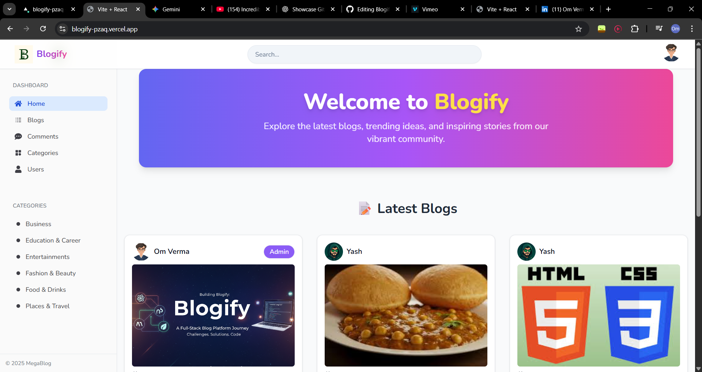
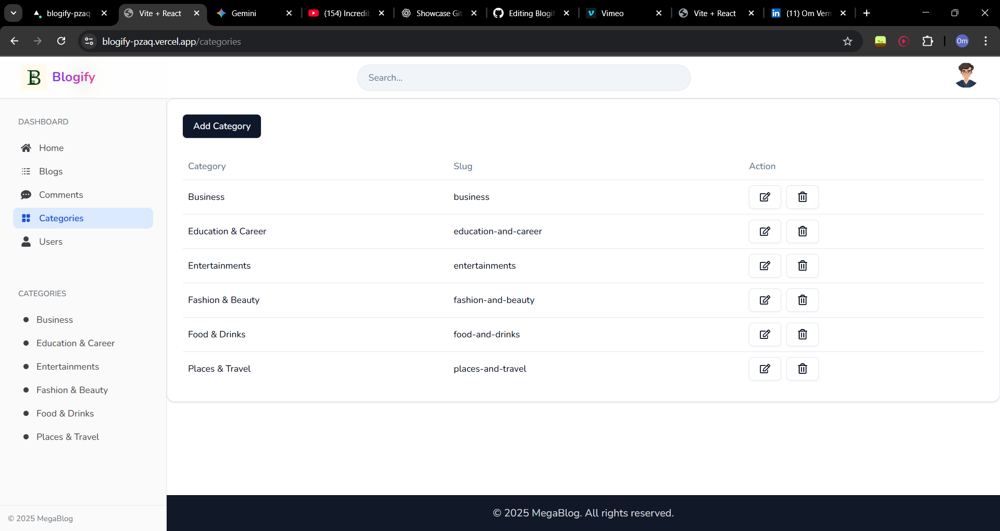

# Blogify: Full-Stack MERN Content Platform

A feature-rich, full-stack blog platform built with the MERN stack (MongoDB, Express.js, React, Node.js), featuring secure authentication, a rich text editor, and a modern, responsive UI.

## 📍 Live Demo & Video

| Live Application | Video Walkthrough (2 mins) |
|------------------|---------------------------|
| [blogify-pzaq.vercel.app](https://blogify-pzaq.vercel.app) | [View on Vimeo](https://vimeo.com/) |

## 📸 Application Preview

### Homepage


### Blog Page


### Blog Editor


### Blog Detail View


### Profile Page


### Category Details


### Comment Details


### Sign In Page


### Admin Dashboard


## ✨ Key Features

**Secure Authentication:** Robust user registration and login system using JWT and Bcryptjs for password hashing, with Google OAuth integration via Firebase.

**Full Blog Management:** Complete CRUD functionality for blog posts, managed through a CKEditor rich text interface.

**Media Handling:** Seamless image uploads and optimization handled by Multer and hosted on Cloudinary.

**User Engagement:** Interactive commenting and like/unlike systems to foster community interaction.

**Content Discovery:** Advanced full-text search functionality and category-based filtering.

**Admin Dashboard:** Role-based access control for administrative tasks like user and content management.

**API Security:** Backend protected with CORS policies and rate limiting to prevent abuse.

**Responsive Design:** A mobile-first UI built with Tailwind CSS and shadcn/ui ensures a great experience on all devices.

## 🛠️ Tech Stack

| Category | Technologies |
|----------|-------------|
| Frontend | React 19, Vite, Tailwind CSS, shadcn/ui, Redux Toolkit, React Router, Firebase, CKEditor |
| Backend | Node.js, Express.js, MongoDB, Mongoose |
| Auth & API | JWT (JSON Web Tokens), Bcryptjs, Google OAuth |
| File Handling | Cloudinary, Multer |
| Deployment | Vercel (Frontend & Serverless Functions) |

## ⚙️ Getting Started

### Prerequisites

- Node.js (v18 or later)
- MongoDB (local instance or a cloud-hosted URI from Atlas)
- Git

### 1. Clone the Repository

```bash
git clone https://github.com/OmVerma420/blogify.git
cd blogify
```

### 2. Backend Setup

```bash
# Navigate to the server directory
cd server

# Install dependencies
npm install

# Create a .env file and add the required environment variables (see .env.example)
touch .env

# Start the backend server
npm run dev
```

### 3. Frontend Setup

```bash
# Navigate to the client directory from the root
cd client

# Install dependencies
npm install

# Create a .env file and add the required environment variables (see .env.example)
touch .env

# Start the frontend development server
npm run dev
```

Your application should now be running:

- Frontend: http://localhost:5173
- Backend API: http://localhost:8000

## 🤝 Contributing

Contributions, issues, and feature requests are welcome! Feel free to check the issues page.

1. Fork the project.
2. Create your Feature Branch (`git checkout -b feature/AmazingFeature`).
3. Commit your changes (`git commit -m 'Add some AmazingFeature'`).
4. Push to the branch (`git push origin feature/AmazingFeature`).
5. Open a Pull Request.

## 📄 License

This project is licensed under the ISC License. See the LICENSE file for more details.

## 👨‍💻 Connect with Me

Let's connect! You can find me on:

- GitHub: [OmVerma420](https://github.com/OmVerma420)
- LinkedIn: [Om Verma](https://linkedin.com/in/om-verma)

---

*Made with using MERN Stack*
=======
